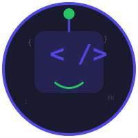

# Tiny Coding Agent

<p align="center">
  
</p>

A lightweight, extensible coding agent built in TypeScript that helps developers with coding tasks across TypeScript, React, JavaScript, Node.js, Bash, and markdown/JSON.

## Features

- **Multi-Provider LLM Support**: Works with OpenAI, Anthropic, Ollama, OpenRouter, and OpenCode
- **MCP Client Integration**: Connect to Model Context Protocol servers for extended capabilities
- **Built-in Tools**: File operations, bash execution, grep, glob, and web search
- **Memory System**: User-initiated persistent storage with relevance-based retrieval
- **Plugin System**: Extend the agent with custom tools
- **CLI-First Design**: Simple commands for chat, run, and config

## Quick Start

```bash
# Install dependencies
bun install

# Run the agent
bun run index.ts
```

## Configuration

A default config is automatically created on first run with:

- **Local LLM**: Ollama with llama3.2 model
- **Context7 MCP**: Up-to-date library documentation (no API key needed)
- **All Tools**: Enabled by default (can be disabled in config)

To customize, create `~/.tiny-agent/config.yaml`:

### Full Configuration Example

```yaml
# Default model to use
defaultModel: qwen2.5-coder:7b

# System prompt (optional, overrides default)
systemPrompt: "You are a helpful coding assistant."

# Provider configurations
providers:
  # OpenAI (GPT models)
  openai:
    apiKey: ${OPENAI_API_KEY}
    baseUrl: https://api.openai.com/v1 # Optional: custom base URL

  # Anthropic (Claude models)
  anthropic:
    apiKey: ${ANTHROPIC_API_KEY}

  # Ollama (local or cloud)
  ollama:
    baseUrl: http://localhost:11434 # Local Ollama
    # For Ollama Cloud, use:
    # baseUrl: https://ollama.com
    # apiKey: ${OLLAMA_API_KEY}

# MCP servers for extended capabilities
mcpServers:
  context7:
    command: npx
    args: ["-y", "@upstash/context7-mcp"]

# Tool configurations
tools:
  read_file:
    enabled: true
  write_file:
    enabled: true
  edit_file:
    enabled: true
  list_directory:
    enabled: true
  bash:
    enabled: true
  grep:
    enabled: true
  glob:
    enabled: true
  web_search:
    enabled: false

# Memory settings (optional)
memoryFile: ~/.tiny-agent/memories.json
maxMemoryTokens: 2000

# Context tracking (optional)
maxContextTokens: 16000
trackContextUsage: true
```

### Ollama Cloud Setup

For access to larger cloud-hosted models via [Ollama Cloud](https://ollama.com/cloud):

```yaml
defaultModel: gpt-oss:120b
providers:
  ollama:
    baseUrl: https://ollama.com
    apiKey: ${OLLAMA_API_KEY}
```

Set your API key:

```bash
export OLLAMA_API_KEY=sk-xxx
```

**Available Ollama Cloud models:**

- `gpt-oss:120b` - 120B parameter model
- `llama-3.1-405b` - 405B parameter model
- And more - see [Ollama Cloud](https://ollama.com/cloud) for full list

**Switching between local and cloud:**

```yaml
# Local Ollama (default, no API key needed)
providers:
  ollama:
    baseUrl: http://localhost:11434

  # Ollama Cloud (requires API key)
  ollama:
    baseUrl: https://ollama.com
    apiKey: ${OLLAMA_API_KEY}

  # OpenRouter - aggregates models from multiple providers
  openrouter:
    apiKey: ${OPENROUTER_API_KEY}
    baseUrl: https://openrouter.ai/api/v1 # Optional: custom base URL

  # OpenCode Zen - curated coding models
  opencode:
    apiKey: ${OPENCODE_API_KEY}
    baseUrl: https://opencode.ai/zen/v1 # Optional: custom base URL
```

## CLI Commands

- `tiny-agent chat` - Start interactive chat session
- `tiny-agent run "prompt"` - Run single prompt and exit
- `tiny-agent config` - Show current configuration
- `tiny-agent status` - Show current status (LLM provider, MCP servers, tools)

### Chat Commands

During interactive chat, use these commands to change settings on the fly:

| Command                     | Description                  | Example                    |
| --------------------------- | ---------------------------- | -------------------------- |
| `/model <name>`             | Switch to a different model  | `/model claude-3-5-sonnet` |
| `/thinking on\|off`         | Enable/disable thinking mode | `/thinking on`             |
| `/effort low\|medium\|high` | Set thinking effort level    | `/effort high`             |
| `/bye`                      | Exit the chat session        | `/bye`                     |

Fuzzy matching is enabled - `/m` → `/model`, `/t` → `/thinking`, `/b` → `/bye`, etc.

**To exit the chat session**, press `Ctrl+D` or type `/bye`.

## Custom Plugins

Extend the agent with custom tools by creating JavaScript files in `~/.tiny-agent/plugins/`:

### Example: Timezone Plugin

Create `~/.tiny-agent/plugins/timezone-tool.js`:

```javascript
const timezoneAlias = {
  vietnam: "Asia/Ho_Chi_Minh",
  hanoi: "Asia/Ho_Chi_Minh",
};

const timezoneTool = {
  name: "get_timezone_time",
  description:
    "Get current time in a specific timezone. Use this when user asks for time in a specific city or country.",
  parameters: {
    type: "object",
    properties: {
      timezone: {
        type: "string",
        description:
          "Timezone string (e.g., 'America/New_York', 'Europe/London'). Country aliases: 'vietnam' → Asia/Ho_Chi_Minh",
      },
      format: {
        type: "string",
        description: "Date format (default: '%Y-%m-%d %H:%M:%S %Z %z')",
      },
    },
    required: ["timezone"],
  },
  async execute(args) {
    const requestedTimezone = args.timezone;
    const format = args.format ?? "%Y-%m-%d %H:%M:%S %Z %z";

    const timezone = timezoneAlias[requestedTimezone.toLowerCase()] ?? requestedTimezone;

    try {
      const { spawn } = await import("node:child_process");
      const command = `date -z "${timezone}" +"${format}"`;

      return new Promise((resolve) => {
        const stdout = [];
        const stderr = [];

        const child = spawn(command, [], { shell: true });

        child.stdout.on("data", (data) => stdout.push(data));
        child.stderr.on("data", (data) => stderr.push(data));

        child.on("close", (exitCode) => {
          const stdoutStr = Buffer.concat(stdout).toString("utf-8").trim();
          const stderrStr = Buffer.concat(stderr).toString("utf-8").trim();

          if (exitCode !== 0) {
            resolve({ success: false, error: `Command failed: ${stderrStr}` });
            return;
          }

          resolve({ success: true, output: stdoutStr });
        });
      });
    } catch (err) {
      const message = err instanceof Error ? err.message : String(err);
      return { success: false, error: `Failed to get timezone time: ${message}` };
    }
  },
};

export default timezoneTool;
```

**After saving, restart the agent:**

```bash
bun run index.ts run "what time in Vietnam now?"
# Output: The current time in Vietnam is 10:00 PM (Local Time).
```

**Plugin structure:**

- `name`: Unique tool identifier (kebab-case)
- `description`: Clear description that helps the LLM understand when to use the tool
- `parameters`: JSON Schema defining expected inputs (properties, required)
- `execute`: Async function that:
  - Receives `args` object with user-provided values
  - Returns `{ success: true, output: "..." }` on success
  - Returns `{ success: false, error: "..." }` on failure

**Enable/disable tools in config:**

```yaml
tools:
  get_timezone_time:
    enabled: true # Enable plugin tool
  web_search:
    enabled: false # Disable built-in tool
```

**Plugin tips:**

- Use JavaScript (not TypeScript) for plugins to avoid type dependency issues
- Provide helpful descriptions - LLM uses them to decide which tool to call
- Handle errors gracefully and return structured results
- Use async/await for any async operations
- Plugin files are auto-loaded on agent startup

## Project Structure

```
src/
  core/       # Agent loop, context management
  tools/      # Built-in tools
  providers/  # LLM provider implementations
  mcp/        # MCP client integration
  cli/        # Command-line interface
  config/     # Configuration loading
```

## Architecture

See [docs/adr/](docs/adr/) for architectural decisions:

- 001: Project Architecture
- 002: LLM Provider Abstraction
- 003: MCP Client Implementation
- 004: Context Management (Handoff)
- 005: Tool System Design
- 006: Plugin System
- 007: Model Registry Pattern
- 008: Memory System (User-Initiated Storage)

## Development

See [AGENTS.md](AGENTS.md) for development guidelines including:

- Build commands: `bun run dev`, `bun run build`, `bun test`, `bun test:watch`
- Code style and TypeScript conventions
- Testing patterns with bun:test
- Project structure overview

## License

MIT
