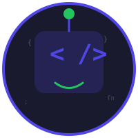

# Tiny Coding Agent

<p align="center">
  
  <br>
  <a href="https://agents.md/"></a>
</p>

A lightweight, extensible coding agent built in TypeScript that helps developers with coding tasks across TypeScript, React, JavaScript, Node.js, Bash, and markdown/JSON.

## Features

- **Rich Terminal UI**: Ink-powered CLI with components for messages, spinners, and tool output
- **TTY Detection**: Automatically adapts to terminal capabilities with plain text fallback
- **Multi-Provider LLM Support**: Works with OpenAI, Anthropic, Ollama, OpenRouter, OpenCode, Z.AI, and ClinePass
- **MCP Client Integration**: Connect to Model Context Protocol servers for extended capabilities
- **Built-in Tools**: File operations, bash execution, grep, glob, and web search
- **Memory System**: User-initiated persistent storage with relevance-based retrieval
- **Agent Skills**: Reusable prompts from agentskills.io or custom SKILL.md files
- **Plugin System**: Extend the agent with custom tools
- **JSON Output Mode**: Machine-readable output for tooling integration

## Quick Install

### One-line Install (macOS/Linux)

```bash
curl -fsSL https://raw.githubusercontent.com/jellydn/tiny-coding-agent/main/scripts/install.sh | sh
```

This downloads the latest release binary for your platform and installs it to `~/.local/bin/`.

**Safer alternative** (inspect before running):

```bash
curl -fsSL -o install.sh https://raw.githubusercontent.com/jellydn/tiny-coding-agent/main/scripts/install.sh
less install.sh  # inspect the script
sh install.sh
```

**Note:** After installation, add `~/.local/bin` to your PATH if not already present.

### Homebrew (macOS)

```bash
brew install jellydn/tap/tiny-agent
```

### Build from Source

```bash
git clone https://github.com/jellydn/tiny-coding-agent.git
cd tiny-coding-agent
bun install
bun run build
./tiny-agent --help
```

### System Requirements

| Requirement  | Minimum Version |
| ------------ | --------------- |
| macOS        | 11.0 (Big Sur)  |
| Linux        | glibc 2.28+     |
| Architecture | x64 or arm64    |

## Provider Login (Onboarding)

Connect an LLM provider so you can start chatting. The `login` command walks you through picking a provider and entering your API key — no manual config editing required.

```bash
tiny-agent login            # Interactive provider picker (recommended for first run)
tiny-agent login openai     # Connect OpenAI directly
tiny-agent login anthropic  # Connect Anthropic directly
tiny-agent login ollama     # Configure local Ollama (no API key needed)
tiny-agent login status     # Show which providers are connected
```

**What it does:**

1. Shows your current provider connection status.
2. Lets you pick a provider (OpenAI, Anthropic, Ollama, OpenRouter, OpenCode, Z.AI, ClinePass).
3. Prompts for your API key with **masked input** (typed characters show as `*`).
4. Saves the key to `~/.tiny-agent/config.yaml` and suggests a default model for that provider.

Get an API key from your provider:

| Provider   | Where to get an API key                          |
| ---------- | ------------------------------------------------ |
| OpenAI     | <https://platform.openai.com/api-keys>           |
| Anthropic  | <https://console.anthropic.com/settings/keys>    |
| OpenRouter | <https://openrouter.ai/keys>                     |
| OpenCode   | <https://opencode.ai>                            |
| Z.AI       | <https://open.bigmodel.cn/usercenter/apikeys>    |
| ClinePass  | <https://cline.bot>                              |
| Ollama     | No key needed — runs locally. Install from <https://ollama.com> |

> **Tip:** For better security, store the key in an environment variable instead of the config file. After running `login`, replace `apiKey: sk-...` with `apiKey: ${OPENAI_API_KEY}` and `export OPENAI_API_KEY=your-key` in your shell profile.

## Provider Logout

Remove a provider's API key from your config. If the logged-out provider was your active default model, you'll be prompted to pick a new one from the remaining connected providers.

```bash
tiny-agent logout            # Interactive picker — choose which provider to disconnect
tiny-agent logout openai     # Remove OpenAI's API key directly
tiny-agent logout status     # Show which providers have keys set
```

**What it does:**

1. Shows your current provider connection status.
2. Lets you pick a provider to disconnect (only providers with an API key set are listed).
3. Removes the `apiKey` field from that provider's config entry — the provider entry itself is preserved (e.g. a custom `baseUrl` stays).
4. If the logged-out provider was the active default model, prompts you to select a new default from the remaining connected providers.

> **Note:** `logout` refuses for Ollama (local) since there's no API key to remove. Use `tiny-agent login ollama` to reconfigure the base URL instead.

## Troubleshooting

### "command not found: tiny-agent"

The binary is not in your PATH. Add it:

```bash
# For bash
echo 'export PATH="$HOME/.local/bin:$PATH"' >> ~/.bashrc && source ~/.bashrc

# For zsh
echo 'export PATH="$HOME/.local/bin:$PATH"' >> ~/.zshrc && source ~/.zshrc
```

### API key errors

The quickest fix is to run the login command, which prompts for your key with masked input and writes it to the config file:

```bash
tiny-agent login        # Interactive picker
tiny-agent login openai # Or connect a specific provider directly
```

Alternatively, set your API key as an environment variable:

```bash
export OPENAI_API_KEY="your-key"
export ANTHROPIC_API_KEY="your-key"
export OLLAMA_API_KEY="your-key"
```

Or configure in `~/.tiny-agent/config.yaml`:

```yaml
providers:
  openai:
    apiKey: ${OPENAI_API_KEY}
```

Check which providers are connected at any time with `tiny-agent login status`.

## Uninstallation

To remove the installed binary:

```bash
rm ~/.local/bin/tiny-agent
```

Or if installed via Homebrew:

```bash
brew uninstall tiny-agent
brew untap jellydn/tap
```

## Configuration

A default config is automatically created on first run with:

- **Suggested Model**: GLM 4.7 (requires Zai API key) or Kimi 2.5 free from OpenCode (requires OpenCode Zen API key)
- **Local Fallback**: Ollama configured for local models
- **Context7 MCP**: Up-to-date library documentation (no API key needed)
- **All Tools**: Enabled by default (can be disabled in config)

To customize, create `~/.tiny-agent/config.yaml`:

### Full Configuration Example

```yaml
# Default model to use
defaultModel: qwen2.5-coder:7b

# System prompt (optional, overrides default)
systemPrompt: "You are a helpful coding assistant."

# Provider configurations
providers:
  # OpenAI (GPT models)
  openai:
    apiKey: ${OPENAI_API_KEY}
    baseUrl: https://api.openai.com/v1 # Optional: custom base URL

  # Anthropic (Claude models)
  anthropic:
    apiKey: ${ANTHROPIC_API_KEY}

  # Ollama (local or cloud)
  ollama:
    baseUrl: http://localhost:11434 # Local Ollama
    # For Ollama Cloud, use:
    # baseUrl: https://ollama.com
    # apiKey: ${OLLAMA_API_KEY}

  # OpenRouter
  openrouter:
    apiKey: ${OPENROUTER_API_KEY}

  # OpenCode
  opencode:
    apiKey: ${OPENCODE_API_KEY}

# MCP servers for extended capabilities (opt-in - only configured servers are enabled)
mcpServers:
  # Context7: Documentation lookups for libraries/frameworks
  context7:
    command: npx
    args: ["-y", "@upstash/context7-mcp"]

  # Serena: Semantic code operations (optional, requires uv)
  # Install uv first: curl -LsSf https://astral.sh/uv/install.sh | sh
  # serena:
  #   command: uvx
  #   args:
  #     [
  #       "--from",
  #       "git+https://github.com/oraios/serena",
  #       "serena-mcp-server",
  #       "--context",
  #       "ide",
  #       "--project",
  #       ".",
  #       "--open-web-dashboard",
  #       "false",
  #     ]

# Disable specific MCP tools by pattern (glob-style matching)
# disabledMcpPatterns:
#   - "mcp_serena_*memories*"    # Disable Serena memory tools
#   - "mcp_serena_*onboarding*"  # Disable Serena onboarding tools

# Disable all MCP servers
# mcpServers: {}

# Or use CLI to manage MCP servers:
# tiny-agent mcp list              # List available servers
# tiny-agent mcp enable context7   # Enable context7
# tiny-agent mcp disable serena    # Disable serena

# Tool configurations
tools:
  read_file:
    enabled: true
  write_file:
    enabled: true
  edit_file:
    enabled: true
  list_directory:
    enabled: true
  bash:
    enabled: true
  grep:
    enabled: true
  glob:
    enabled: true
  web_search:
    enabled: false

# Memory settings (optional)
memoryFile: ~/.tiny-agent/memories.json
maxMemoryTokens: 2000

# Context tracking (optional)
maxContextTokens: 16000
trackContextUsage: true
```

### Ollama Cloud Setup

For access to larger cloud-hosted models via [Ollama Cloud](https://ollama.com/cloud):

Get your API key and export it as an environment variable:

```bash
export OLLAMA_API_KEY="your-api-key"
```

**Config:**

```yaml
defaultModel: gpt-oss:120b
providers:
  ollama:
    baseUrl: https://ollama.com
    apiKey: ${OLLAMA_API_KEY}
```

### OpenCode Zen

[OpenCode Zen](https://opencode.ai/zen) provides curated, tested models for coding agents.

```bash
# Get API key from https://opencode.ai/auth
export OPENCODE_API_KEY="your-api-key"
```

**Config:**

```yaml
providers:
  opencode:
    apiKey: ${OPENCODE_API_KEY}
```

**Available models:**

- `opencode/claude-opus-4-6` - Latest Claude Opus (also: 4-1, 4-5)
- `opencode/claude-sonnet-4-5` - Latest Claude Sonnet (also: 4)
- `opencode/claude-haiku-4-5` - Latest Claude Haiku (also: 3-5-haiku)
- `opencode/gemini-3-pro` - Latest Gemini (also: 3-flash)
- `opencode/glm-4.7` - Latest GLM (also: 4.6)
- `opencode/gpt-5.2-codex` - Latest GPT-5.2 Codex (also: gpt-5.2)
- `opencode/gpt-5.1-codex-max` - Latest GPT-5.1 (also: codex, codex-mini, gpt-5.1)
- `opencode/gpt-5-codex` - Latest GPT-5 (also: gpt-5, gpt-5-nano)
- `opencode/kimi-k2.5` - Latest Kimi (also: k2, k2-thinking)
- `opencode/minimax-m2.1` - Latest Minimax

**Free models:**

- `opencode/big-pickle` - OpenCode's flagship coding model
- `opencode/kimi-k2.5-free`
- `opencode/minimax-m2.1-free`
- `opencode/trinity-large-preview-free`

**Usage:**

```bash
tiny-agent --provider opencode --model opencode/big-pickle "fix this bug"
tiny-agent --provider opencode --model opencode/gpt-5.2-codex "write a function"
```

## CLI Commands

| Command                     | Description                          |
| --------------------------- | ------------------------------------ |
| `tiny-agent chat`           | Interactive chat session             |
| `tiny-agent run "prompt"`   | Single prompt, then exit             |
| `tiny-agent login`          | Connect a provider (onboarding)      |
| `tiny-agent login status`   | Show provider connection status      |
| `tiny-agent logout`         | Remove a provider's API key          |
| `tiny-agent logout status`  | Show which providers have keys set   |
| `tiny-agent config`         | Show current config                  |
| `tiny-agent status`         | Show provider, MCP, tools            |
| `tiny-agent mcp`            | Manage MCP servers                   |
| `tiny-agent memory`         | Manage memories                      |
| `tiny-agent skill`          | Manage skills                        |

### MCP Server Management

```
tiny-agent mcp list              # List available MCP servers
tiny-agent mcp enable <name>     # Enable a default MCP server
tiny-agent mcp disable <name>    # Disable an MCP server
tiny-agent mcp add <name> <cmd>  # Add a custom MCP server
```

**Default MCP Servers:**

- **context7**: Documentation lookup via `@upstash/context7-mcp`
- **serena**: Semantic code operations (requires `uv`)

**Examples:**

```bash
# Enable serena (opt-in, requires uv)
tiny-agent mcp enable serena

# Disable serena
tiny-agent mcp disable serena

# Add a custom MCP server
tiny-agent mcp add myserver npx -y @org/mcp-server
```

### Options

| Option              | Description                                             |
| ------------------- | ------------------------------------------------------- |
| `--model <name>`    | Override default model                                  |
| `--provider <name>` | Override provider (openai\|anthropic\|ollama\|opencode) |
| `--json`            | Output in JSON format (for programmatic consumption)    |
| `--verbose, -v`     | Enable verbose logging                                  |
| `--save`            | Save conversation to file                               |
| `--no-memory`       | Disable memory                                          |
| `--allow-all, -y`   | Auto-approve all tool confirmations                     |

### Tool Confirmation

Dangerous tools require confirmation before execution:

- **Destructive**: `write_file`, `edit_file`, `bash` (git commit, rm, redirection)
- **Sensitive files**: `read_file` (.env, SSH keys, credentials)
- **External**: MCP tools

**Smart Detection**: Safe bash commands like `git status`, `ls`, `cat`, `npm test` skip confirmation.

**Interactive Prompt**:

```
⚠️  The following operations will be performed:
  [1] write_file: Will create or overwrite file
      (path="example.ts")
  [2] bash: Destructive command: rm file.txt

Approve all? (y/N), or enter number to approve individually:
```

**Bypass Confirmations**: Use `--allow-all` or `-y` flag for automation/CI.

## Agent Skills

Tiny-agent supports **Agent Skills** - reusable prompt templates that can be loaded and used during conversations. Skills are defined in `SKILL.md` files with YAML frontmatter.

### Built-in Skills

The agent includes several built-in skills for common tasks. Type `@` to see available skills, or use `/skill` to list them.

### Custom Skills Directory

Add your own skills by creating `SKILL.md` files in skill directories:

```yaml
# ~/.tiny-agent/skills/my-custom-skill/SKILL.md
---
name: my-custom-skill
description: A custom skill for XYZ tasks
allowedTools:
  - read_file
  - edit_file
  - write_file
---

You are an expert at XYZ. When given a task:
1. First analyze the codebase to understand the structure
2. Then implement the requested changes
3. Finally verify your changes work correctly
```

Enable custom skills directories in config:

```yaml
skillDirectories:
  - ~/.tiny-agent/skills/ # Global: available in all projects
  - .skills/ # Project-local: .skills/ directory in your project
```

### Skill Format

Each skill must have a `SKILL.md` file with:

```yaml
---
name: skill-name
description: Brief description of what the skill does
allowedTools: # Optional: restrict which tools can be used
  - read_file
  - write_file
license: MIT # Optional
---
# Skill content (Markdown)
Your skill prompt here...
```

The skill content is loaded as a system prompt modification when the skill is activated.

### Loading Skills

The agent supports skills from multiple sources:

- **[vercel/agent-skills](https://github.com/vercel-labs/agent-skills)**: Community-contributed skills (limited selection)

  ```bash
  git clone https://github.com/vercel-labs/agent-skills.git ~/.tiny-agent/skills/vercel-agent-skills
  ```

- **[skills.sh](https://skills.sh/)**: Browse and download individual skills from a larger registry

Skills are automatically discovered from `SKILL.md` files in your configured skill directories.

### Chat Commands

| Command         | Description                                            |
| --------------- | ------------------------------------------------------ |
| `/help`         | Show available commands                                |
| `/clear`        | Clear conversation history                             |
| `/model <name>` | Switch model                                           |
| `/login`        | Show provider connection status + onboarding guidance  |
| `/logout`       | Show logout guidance (use top-level `tiny-agent logout`)  |
| `/tools`        | View tool execution history                            |
| `/mcp`          | Show MCP server status                                 |
| `/memory`       | List stored memories                                   |
| `/skill [name]` | List all skills, or load a specific skill              |
| `@<skill-name>` | Load a skill (type @ to see picker)                    |
| `/exit`         | Exit chat (Ctrl+D also works)                          |

## Custom Plugins

Add tools via `~/.tiny-agent/plugins/<name>.js`:

```javascript
export default {
  name: "my_tool",
  description: "What this tool does",
  parameters: {
    type: "object",
    properties: { input: { type: "string" } },
    required: ["input"],
  },
  async execute({ input }) {
    return { success: true, output: "result" };
  },
};
```

Enable in config:

```yaml
tools:
  my_tool: { enabled: true }
```

## Project Structure

```
src/
  core/       # Agent loop, memory, context
  tools/      # Built-in tools
  providers/  # LLM clients (OpenAI, Anthropic, Ollama)
  mcp/        # MCP client
  cli/        # CLI interface
  ui/         # Ink UI components (App, Message, Spinner, ToolOutput)
```

## Observability

Every agent run is traced end-to-end so you can debug failures, measure latency, and estimate cost. Trace metadata is emitted as structured JSON logs and OpenTelemetry spans, and the final stream chunk carries an `observability` summary.

### What is captured

- A unique `traceId` per run, propagated through retrieval, tool execution, and the LLM call.
- Structured JSON logs with `traceId`, `event`, `model`, `provider`, latency, token usage, estimated cost, and sanitized errors.
- OpenTelemetry spans: `http.request` → `retrieval` / `tool.execution` / `llm.request`, with `ai.*`, `tool.*`, and `retrieval.*` attributes.
- Normalized token usage (input / output / total / cached / reasoning) across providers. Missing usage is logged as `unavailable`, never fabricated.
- Estimated USD cost from `src/observability/model-pricing.json`, labeled as an estimate.

### Privacy

- Full prompt/response logging is **off by default**; only a redacted, truncated preview is stored.
- API keys, authorization headers, passwords, and `sk-…` tokens are redacted from logs and previews.
- Stack traces are never exposed to clients; only sanitized error type and message are logged.

### Demo

Run the trace demo without any API key:

```bash
bun run index.ts trace --mock "explain request tracing"
# or, after building:
./tiny-agent trace --mock "explain request tracing"
```

Output shows the trace ID, latency, token counts, and estimated cost. Add `--json` for a machine-readable response including the `meta` block.

### Configuration

Observability can be tuned via environment variables (override config-file values):

| Variable | Default | Description |
|----------|---------|-------------|
| `TINY_AGENT_TELEMETRY_ENABLED` | `true` | Enable OpenTelemetry tracing (console exporter). |
| `TINY_AGENT_LANGFUSE_ENABLED` | `false` | Enable optional Langfuse integration (also requires `LANGFUSE_*` env vars). |
| `TINY_AGENT_LOG_FULL_PROMPTS` | `false` | Log full prompt/response text instead of a redacted preview. |
| `TINY_AGENT_PREVIEW_LENGTH` | `200` | Max characters of the prompt/response preview. |
| `TINY_AGENT_DETAILED_RESPONSE_META` | `true` | Include detailed usage metadata in the response `meta` block. |
| `TINY_AGENT_PRICING_CONFIG` | _embedded_ | Path to an override pricing JSON file. |
| `LANGFUSE_SECRET_KEY` | _unset_ | Langfuse secret key (enables Langfuse when set with the public key). |
| `LANGFUSE_PUBLIC_KEY` | _unset_ | Langfuse public key. |
| `LANGFUSE_BASE_URL` | `https://cloud.langfuse.com` | Langfuse backend URL. |

The OpenTelemetry exporter is configurable (`src/observability/telemetry.ts`) so an OTLP backend can be added later without changing tracing logic. Langfuse and telemetry failures are isolated and never break a user request.

## Architecture

See [docs/adr/](docs/adr/) for architectural decisions:

- 001: Project Architecture
- 002: LLM Provider Abstraction
- 003: MCP Client Implementation
- 004: Context Management (Handoff)
- 005: Tool System Design
- 006: Plugin System
- 007: Model Registry Pattern
- 008: Memory System
- 009: Tool Confirmation System
- 010: Ink CLI Integration
- 011: Multi-Agent System (Plan/Build/Explore)
- 012: GatewayOpenAIProvider Base Class (30% threshold)
- 013: ClinePass Live Model Lookup
- 014: Login Command Onboarding Design

## Development

This project follows the [AGENTS.md](https://agents.md/) standard for guiding coding agents. See [AGENTS.md](AGENTS.md) for:

- Build commands: `bun run dev`, `bun run build`, `bun test`
- TypeScript conventions and code style
- Testing patterns with bun:test

### Using Make or Just

For easier development, you can use either **Make** (traditional) or **Just** (modern alternative):

**Using Make** (pre-installed on most Unix systems):
```bash
make help          # Show all available targets
make dev           # Run in watch mode
make build         # Build the binary
make test          # Run tests
make check         # Quick check (lint + typecheck)
```

**Using Just** (install with `cargo install just` or `brew install just`):
```bash
just               # List all available recipes
just dev           # Run in watch mode
just build         # Build the binary
just test          # Run tests
just check         # Quick check (lint + typecheck)
```

Both provide the same functionality - choose whichever you prefer!

For a complete list of commands and more details, see the [Development Tasks Guide](docs/development-tasks.md).

## License

MIT
